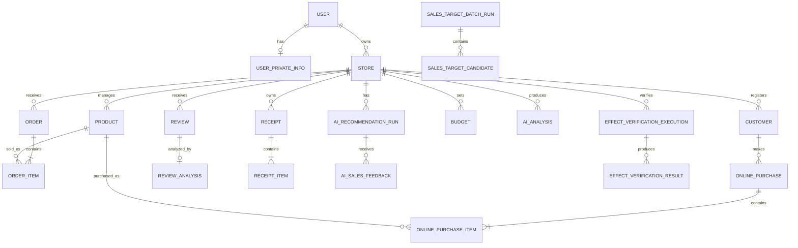

# BP20-Backend

<p align="center">
  
</p>

**Market Poke**의 Backend를 관리하는 저장소입니다.

Spring Boot 기반 REST API로 매장·상품·주문·매출·고객 데이터를 관리하고, AI 분석·추천·영수증 OCR·상품 이미지 생성 등의 기능을 AI 서버 및 외부 API와 연동합니다. MySQL과 Redis를 사용하며, Docker Compose를 통해 Backend와 관련 서비스를 함께 실행할 수 있도록 구성되어 있습니다.

---

## Market Poke란

온·오프라인 매장 데이터를 분석해 **AI 기반 운영 전략을 제안하고, 실행 결과까지 검증**하는 B2B 경영 분석 플랫폼입니다.

주요 고객은 개별 점주가 아니라 네이버페이·토스플레이스·카카오페이 같은 **POS·결제 단말기 사업자**입니다. 결제 플랫폼이 '결제 서비스'에서 '매장 운영 플랫폼'으로 확장하는 흐름에 필요한 분석 계층을 제공합니다.

기존 서비스가 데이터를 **보여주는** 데서 멈춘다면, Market Poke는 한 단계 더 갑니다.

```
분석  →  추천  →  실행  →  검증
```

| 기능 | 설명 |
| --- | --- |
| 매장별 맞춤 전략 | 매출 변화의 내·외부 원인을 진단하고 대응 방안을 추천, 실행 전후 성과를 비교 검증 |
| 리뷰 분석 | 리뷰를 5개 속성 × 3개 감성으로 분류하고 매장별 키워드를 추출해 월간 개선 우선순위 제시 |
| O2O 커머스 | 오프라인 상품의 온라인 판매 확장, AI 상품 이미지 생성, 온·오프라인 쿠폰 연계 |
| 신규 가맹점 영업 타겟 추천 | 상권 성장성·유동인구·리뷰 활성도 등을 가중합해 후보를 스코어링하고 AI Agent가 검수 |
| 가계부·발주 관리 | 영수증 OCR 기반 가계부 리포트, 날씨·매출 기반 발주 추천 |

---


## 이 저장소가 하는 일

Market Poke의 Backend 애플리케이션 코드를 관리하는 저장소입니다.

프론트엔드와 AI 서버에서 요청을 받아 비즈니스 로직을 처리하고, 데이터베이스·캐시·외부 API·AI 서버를 연동해 서비스에 필요한 API를 제공합니다.

- REST API — 매장·상품·주문·매출·고객 등 핵심 도메인 기능 제공
- 데이터 관리 — MySQL 기반 영속성 관리 및 Redis 기반 캐시·세션 처리
- AI 기능 연동 — 매출 분석·추천·리뷰 분석·영수증 OCR·상품 이미지 생성 연동
- 인증·보안 — JWT 인증, 권한 관리, 개인정보 암호화 및 마스킹
- 실행 환경 — Docker Compose를 통한 Backend·MySQL·Redis·AI 서버 통합 실행

## 관련 저장소

| 저장소 | 역할 |
| --- | --- |
| [BP20-FE](https://github.com/AIVLE-07-20-big-project/BP20-FE) | React 프론트엔드 |
| [BP20-BE](https://github.com/AIVLE-07-20-big-project/BP20-BE) | Spring Boot API 서버 (이 저장소) |
| [BP20-AI](https://github.com/AIVLE-07-20-big-project/BP20-AI) | FastAPI AI 서버, Celery Worker·Beat |
| [BP20-INFRA](https://github.com/AIVLE-07-20-big-project/BP20-INFRA) | AWS 인프라 |
---
## 3. 프로젝트 구성

```text
BP20-BE/
├─ src/
│  ├─ main/
│  │  ├─ java/com/bp20/backend/
│  │  │  ├─ api/                    # 도메인별 Controller·Service·Repository·DTO
│  │  │  │  ├─ ai/                 # AI 서버 연동 및 분석 결과
│  │  │  │  ├─ auth/               # 회원가입·로그인·Refresh Token
│  │  │  │  ├─ budget/             # 카테고리별 예산
│  │  │  │  ├─ commerce/           # 온라인 판매·할인·쿠폰
│  │  │  │  ├─ csv/                # 상품·재고·매출 CSV 처리
│  │  │  │  ├─ customer/           # 매장 고객 관리
│  │  │  │  ├─ effectverification/ # 추천 효과 검증 및 ROI
│  │  │  │  ├─ iam/                # 관리자·점주 계정 및 감사 로그
│  │  │  │  ├─ location/            # 주소·매장 위치 검색
│  │  │  │  ├─ notice/              # 관리자 공지 및 첨부파일
│  │  │  │  ├─ order/               # 주문·주문상품 및 CSV 임포트
│  │  │  │  ├─ product/             # 온·오프라인 통합 상품
│  │  │  │  ├─ productimage/        # AI 상품 이미지 생성·저장
│  │  │  │  ├─ receipt/             # 영수증 OCR 및 지출 분석
│  │  │  │  ├─ recommendation/      # 주문 상품 추천 및 이력
│  │  │  │  ├─ review/              # 리뷰 및 감성 분석
│  │  │  │  ├─ salestarget/         # 신규 가맹점 영업 타겟
│  │  │  │  ├─ store/               # 매장 및 매장 리뷰 정보
│  │  │  │  ├─ user/                # 사용자 개인정보·동의
│  │  │  │  └─ weather/              # 기상청 날씨 데이터
│  │  │  └─ global/                 # 공통 응답·예외·보안·로깅·저장소
│  │  └─ resources/
│  │     ├─ application*.yml        # local·docker·mock·prod 프로필
│  │     └─ mock/                   # 테스트용 schema 및 seed data
│  └─ test/                         # 단위 테스트·통합 테스트
│
├─ docs/                            # 백엔드 연동·성능 관련 문서
├─ sample-data/                     # CSV 및 검증용 샘플 데이터
├─ compose.yaml                     # MySQL·Redis·AI·Spring 통합 실행
├─ Dockerfile                       # Spring Boot 컨테이너 이미지
├─ build.gradle                     # Gradle 빌드 및 운영 task
└─ .env.example                     # 환경 변수 템플릿
```

## 4. 기술 스택

### Backend

- Language / Framework: Java 21, Spring Boot 4.0.6, Spring MVC·WebFlux
- Architecture: 도메인형 패키지 구조 기반의 REST API 서버
- Persistence: Spring Data JPA, Hibernate, MySQL 8
- Cache / Session: Spring Data Redis, Refresh Token 저장소
- Security: Spring Security, JWT, BCrypt, 로그인 실패 잠금, CAPTCHA
- Privacy: AES-GCM 개인정보 암호화 및 개인정보 마스킹
- Validation: Spring Boot Validation

### AI 및 외부 서비스 연동

- AI Server: BP20-AI FastAPI와 HTTP 기반 연동
- AI 기능: 매출 예측, 리뷰 감성 분석, 추천, 영수증 OCR, 상품 이미지 생성
- External API: 기상청 날씨 API, Kakao Local API
- Async Processing: AI 분석 결과·추천 효과 검증·스케줄러 기반 배치 처리

### Storage 및 문서화

- Object Storage: AWS S3, S3 미설정 시 로컬 디스크 저장소로 fallback
- File Processing: Apache Commons CSV, Commons IO
- API Documentation: Springdoc OpenAPI / Swagger UI
- Monitoring: Spring Boot Actuator health endpoint

### 개발 도구

- Build: Gradle Wrapper
- Test: JUnit 5, Spring Boot Test, H2
- Container: Docker, Docker Compose
- Local Infrastructure: MySQL 8, Redis 7, Redis Insight, BP20-AI FastAPI

## 시스템 구성

```text
Frontend
    │
    ▼
Spring Boot Backend :8080
    ├── MySQL :3306       데이터 저장
    ├── Redis :6379       Refresh Token 및 작업 상태
    ├── BP20-AI FastAPI :8000
    └── AWS S3            이미지·첨부파일·AI 자산 저장
```

Docker Compose 기반으로 Spring Boot, MySQL, Redis, BP20-AI FastAPI, Celery Worker/Beat가 구성됩니다.

## 5. 전체 ERD

BP20-BE의 데이터 모델은 사용자·매장·상품을 중심으로 주문/매출, 고객, 리뷰, AI 분석 결과가 연결되는 구조입니다. 영수증과 예산은 AI 가계부 영역에서 관리하며, 관리자 기능과 추천 효과 검증 데이터는 별도 도메인으로 분리되어 있습니다.



### 핵심 엔티티

| 영역 | 주요 엔티티 | 역할 |
| --- | --- | --- |
| 사용자·매장 | `User`, `UserPrivateInfo`, `Store` | 인증 사용자와 개인정보, 점주 매장 관리 |
| 상품·주문 | `Product`, `Order`, `OrderItem` | 온·오프라인 공통 상품과 매출 원장 |
| 고객·커머스 | `Customer`, `OnlinePurchase`, `Coupon`, `Discount` | 고객 구매·프로모션 및 O2O 전환 |
| AI 가계부 | `Receipt`, `ReceiptItem`, `Budget`, `AiAnalysis` | OCR 영수증, 지출 분석, 예산 리포트 |
| 리뷰·추천 | `Review`, `ReviewAnalysis`, `AiRecommendationRun` | 리뷰 분석 및 상품 추천 실행 이력 |
| 검증·영업 | `EffectVerificationExecution`, `EffectVerificationResult`, `SalesTargetBatchRun`, `SalesTargetCandidate` | 추천 효과 측정 및 신규 영업 타겟 관리 |

> 위 다이어그램은 도메인 간 핵심 관계를 표현한 개요 ERD입니다. 실제 컬럼, 인덱스, 제약조건은 JPA Entity와 운영 데이터베이스 스키마를 기준으로 관리합니다.

상세한 도메인별 ERD와 테이블 설명은 [DB 설계 문서](docs/db/README.md)에서 확인할 수 있습니다.

## 6. 팀원

<table>
  <tr>
    <td align="center">
      <a href="https://github.com/Bakhyoungwoo">
        
        <br />Bakhyoungwoo
      </a>
    </td>
    <td align="center">
      <a href="https://github.com/yugyeong2">
        
        <br />yugyeong2
      </a>
    </td>
    <td align="center">
      <a href="https://github.com/Parkhuisang">
        
        <br />Parkhuisang
      </a>
    </td>
  </tr>
  <tr>
    <td align="center">
      <a href="https://github.com/thadus2">
        
        <br />thadus2
      </a>
    </td>
    <td align="center">
      <a href="https://github.com/tkdwns">
        
        <br />tkdwns
      </a>
    </td>
    <td align="center">
      <a href="https://github.com/Mr-Penguin1">
        
        <br />Mr-Penguin1
      </a>
    </td>
  </tr>
</table>
