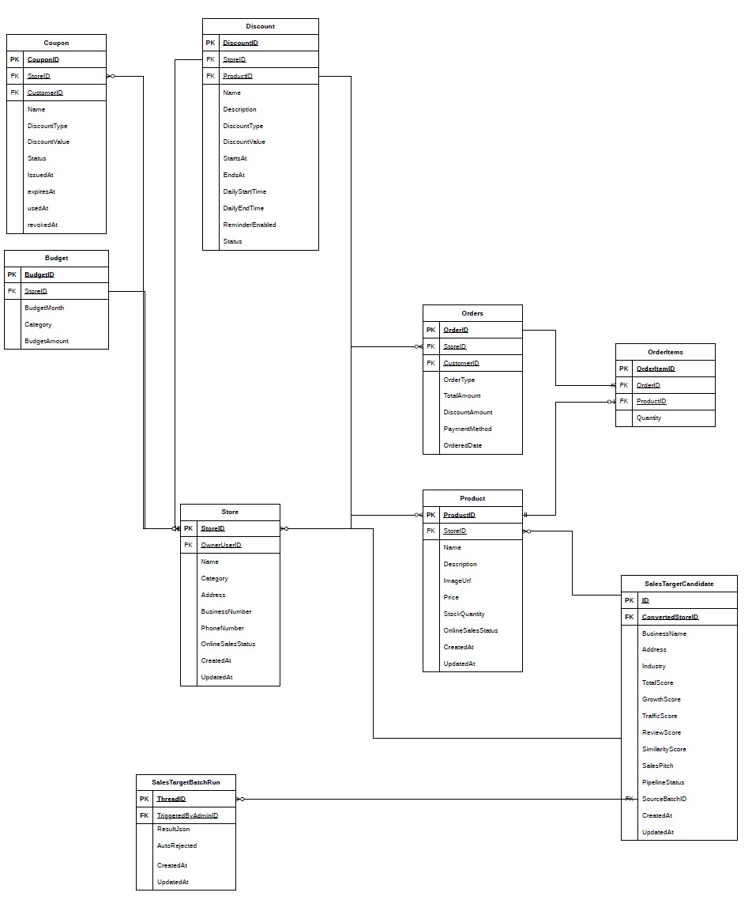
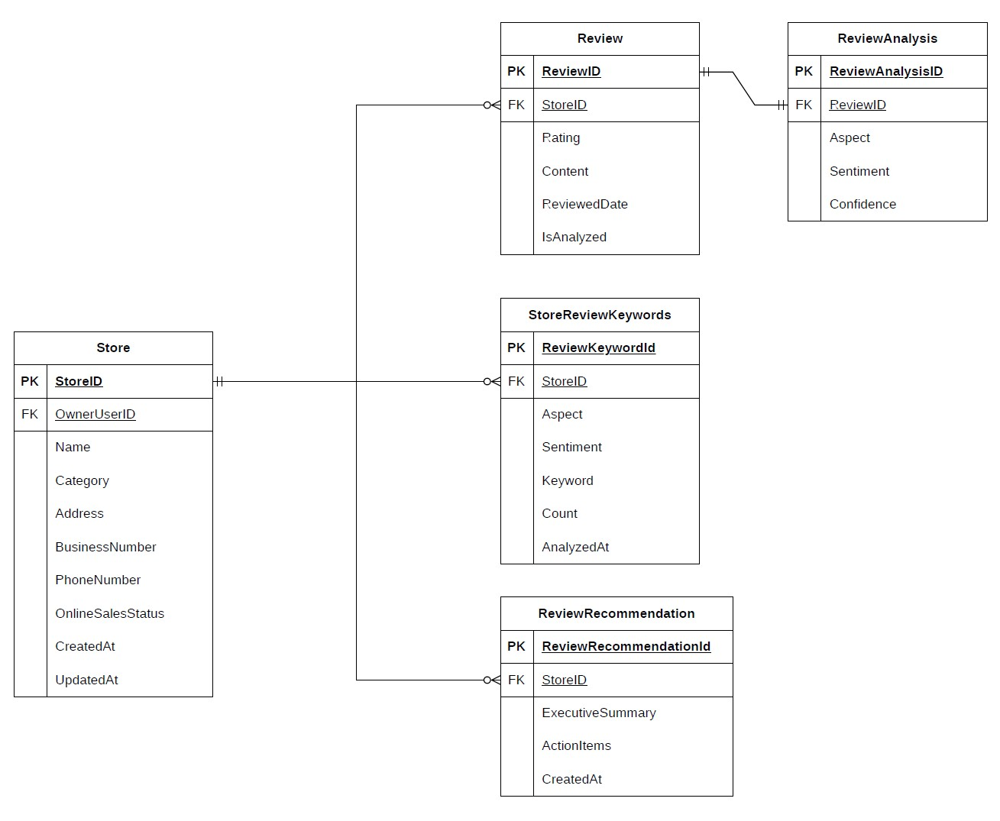
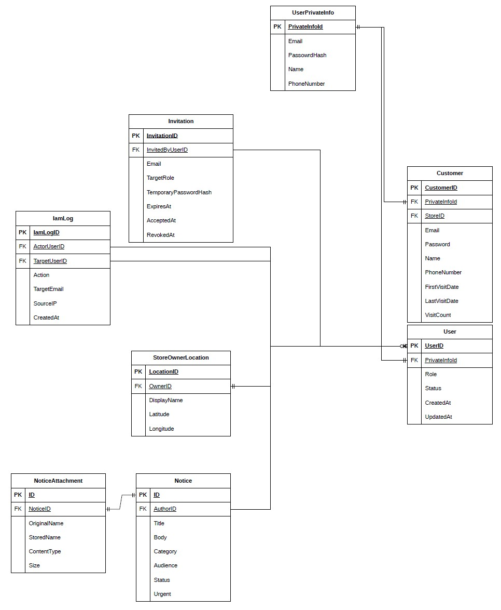
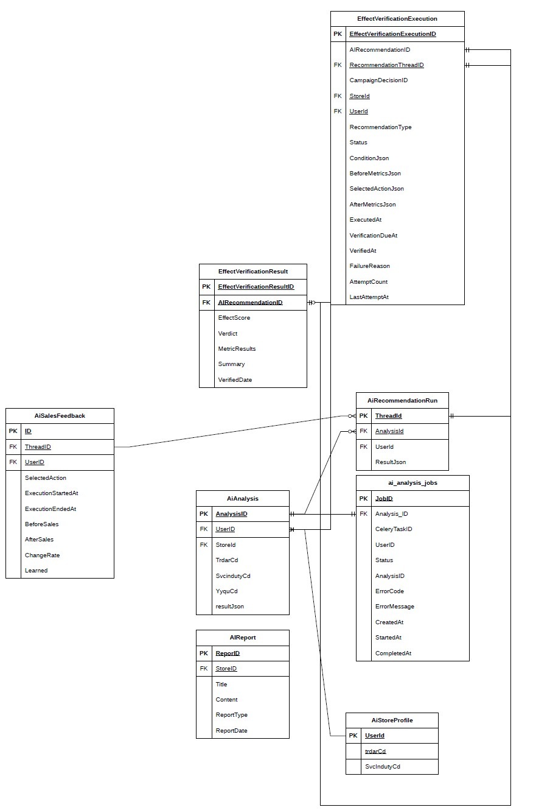

# Database

BP20 백엔드의 도메인별 데이터베이스 구조와 엔티티 관계를 정리한 문서입니다.

## ERD

### 커머스

커머스 도메인은 매장의 상품 판매와 고객 혜택을 관리합니다. 상품을 중심으로 할인과 쿠폰을 적용하고, 온라인 판매 및 구매 이력을 매장·고객·주문 데이터와 연결해 온·오프라인 판매 흐름을 통합합니다.

#### 핵심 테이블

| 테이블 | 설명 |
| --- | --- |
| `store` | 상품과 주문이 귀속되는 매장 정보 |
| `product` | 온·오프라인에서 판매되는 상품 정보 |
| `customer` | 매장에 등록된 고객 정보 |
| `order` | 매장에서 발생한 주문 정보 |
| `order_item` | 주문에 포함된 상품, 수량, 판매 금액 |
| `online_purchase` | 온라인 채널에서 발생한 구매 이력 |
| `coupon`, `discount` | 고객 또는 상품에 적용되는 혜택 정보 |

`order`와 `product`는 하나의 주문에 여러 상품이 포함될 수 있고 하나의 상품이 여러 주문에 포함될 수 있으므로 `order_item`을 중간 테이블로 사용합니다. `order_item`에 주문 당시의 수량과 판매 금액을 저장해 이후 상품 가격이 변경되어도 과거 매출 데이터를 보존할 수 있도록 설계했습니다.

### 리뷰

리뷰 도메인은 매장에 등록된 고객 리뷰와 리뷰 분석 결과를 관리합니다. 원본 리뷰 데이터를 보존하면서 AI 분석 결과를 별도로 저장해 리뷰 내용과 감성·측면별 분석 결과를 분리하고, 매장 운영 개선과 추천 효과 검증에 활용할 수 있도록 구성합니다.

#### 핵심 테이블

| 테이블 | 설명 |
| --- | --- |
| `review` | 고객이 매장과 상품에 남긴 원본 리뷰 |
| `review_analysis` | 리뷰에 대한 AI 감성 및 측면별 분석 결과 |
| `store` | 리뷰가 작성된 매장 정보 |
| `customer` | 리뷰를 작성한 고객 정보 |

`review`는 변경되지 않는 원본 데이터와 매장·고객 연결 정보를 관리하고, `review_analysis`는 AI 분석 결과를 별도로 관리합니다. 분석 로직이나 모델이 변경되어도 원본 리뷰를 유지할 수 있으며, 분석 결과만 재생성하거나 버전별로 관리할 수 있는 구조입니다.

### 사용자·공지사항

사용자·공지사항 도메인은 사용자 계정과 개인정보, 권한 및 관리자 공지 기능을 관리합니다. 사용자 기본 정보와 민감한 개인정보를 분리하고, 공지사항과 첨부파일을 연결해 관리자와 점주에게 필요한 운영 정보를 제공합니다.

#### 핵심 테이블

| 테이블 | 설명 |
| --- | --- |
| `user` | 로그인 계정, 역할, 상태 등 사용자 기본 정보 |
| `user_private_info` | 이름, 연락처 등 보호가 필요한 개인정보 |
| `privacy_consent` | 개인정보 수집·이용 동의 이력 |
| `notice` | 관리자가 작성하는 공지사항 |
| `notice_attachment` | 공지사항에 연결된 첨부파일 정보 |

사용자 계정과 개인정보를 분리해 접근 제어와 개인정보 보호 범위를 명확하게 했습니다. 공지사항과 첨부파일은 일대다 관계로 구성해 하나의 공지에 여러 파일을 연결할 수 있으며, 파일 본문은 저장소에 보관하고 데이터베이스에는 파일 메타데이터와 저장 위치를 관리합니다.

### AI 효과 검증

AI 효과 검증 도메인은 AI 추천이 실제 매장 성과에 미친 영향을 추적하고 검증합니다. 추천 실행 단위와 검증 실행 이력을 기준으로 매출·리뷰 등의 측정 결과를 저장하며, 추천 전후의 성과와 ROI를 확인할 수 있도록 구성합니다.

#### 핵심 테이블

| 테이블 | 설명 |
| --- | --- |
| `ai_recommendation_run` | AI 추천의 실행 및 추천 결과 단위 |
| `effect_verification_execution` | 추천 효과를 측정하기 위한 검증 실행 정보 |
| `effect_verification_result` | 검증 기간의 매출·리뷰 등 측정 결과 |
| `ai_sales_feedback` | 추천 결과에 대한 매출 및 운영 피드백 |
| `sales_target_batch_run` | 신규 영업 타겟 분석 배치 실행 정보 |
| `sales_target_candidate` | AI가 산출한 신규 영업 대상 후보 |

추천 실행과 효과 검증 실행을 분리해 하나의 추천이 여러 검증 기간 또는 재시도를 가질 수 있도록 했습니다. 검증 결과는 실행 이력에 종속되며, 매출·리뷰 지표를 기준으로 추천 전후의 성과 차이와 ROI를 계산합니다. 배치 실행 정보와 후보 매장을 분리해 배치 상태와 개별 후보의 승인·반려 상태를 독립적으로 관리할 수 있습니다.
